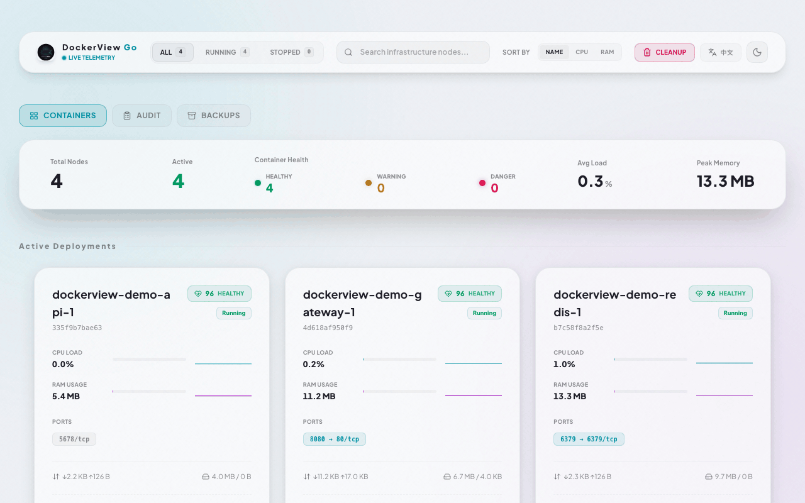
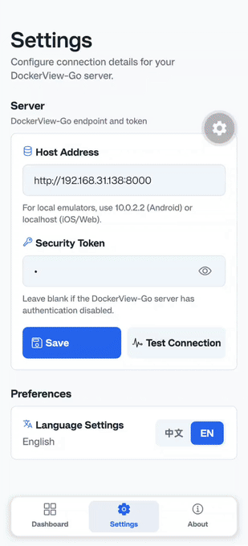

<div align="center">

<!-- markdownlint-disable MD033 -->


# DockerView-Go

A beautiful terminal-based Docker container monitoring tool built with Go and bubbletea, featuring a gorgeous real-time web dashboard.

[](https://github.com/zsuroy/dockerview-go/releases/latest)
[](https://github.com/zsuroy/dockerview-go/actions/workflows/ci.yml)
[](https://github.com/zsuroy/dockerview-go/releases)
[](https://github.com/zsuroy/dockerview-go/blob/master/LICENSE)
[](https://go.dev/)
[](https://react.dev/)
[](https://docs.docker.com/engine/reference/api/client-lib/)

English | [中文](README_zh.md)

</div>

## Demo



## Features

- **Real-time Monitoring**: Updates every second.
- **Beautiful TUI**: Built with [bubbletea](https://github.com/charmbracelet/bubbletea) and [lipgloss](https://github.com/charmbracelet/lipgloss) with keybindings for start, stop, restart, inline logs viewing, and command execution.
- **Real-Time Web Dashboard**: Enable the HTTP server (`-server`) to broadcast real-time container telemetry using Server-Sent Events (SSE) `/stream` and host a gorgeous glassmorphism web console with live SVG sparkline history, status filters, search highlighting, and 3D hover effects.
- **Web Container Controls**: Start, stop, and restart containers directly from the Web Dashboard (only showing containers stopped via dockerview during current session to keep the list clean).
- **Container Health Scoring**: Dynamically calculates a 0-100 health score for each container based on CPU load, memory usage, disk I/O, network rate, restarts, and uptime. Features a grouped top panel showing healthy, warning, and dangerous counts with neon pulsing indicators.
- **Inline Logs Modal**: Read container logs from TUI or in an advanced web modal featuring case-insensitive keyword searching, log level filters (ALL, DEBUG, INFO, WARN, ERROR), customizable tail line counts, match highlighting, auto-scroll, and instant log file downloads.
- **Command Execution**: Execute shell commands inside running containers from the TUI (`e` in the action panel) or the web dashboard modal. Features quick template shortcuts on web (directory list, environment variables, disk usage, etc.), stdout/stderr output separation, exit status code display, copy output helper, and token verification security.
- **Token Security**: Secured control API and log endpoints with token verification. Automatically generates secure startup keys, supports guest/read-only mode, and stores session tokens in localStorage.
- **Multi-language Support**: Interactive web dashboard supports language toggling between English and Chinese (via a button in the navigation header).
- **Mobile Client**: A cross-platform Expo / React Native app mirrors the dashboard on your phone — live monitoring, start/stop/restart controls, log filtering, and command execution, with English / 简体中文 support.
- **Theme Toggle**: Real-time web dashboard supports toggling between light and dark themes (with automatic system color-scheme preference detection).
- **One-Click Web Upgrade**: Trigger browser-based self-upgrades directly next to the version badge in the footer, which queries GitHub releases, automatically identifies the installation type (`go install` or `binary`), performs atomic updates, and streams step-by-step progress events in real-time.
- **Port Mappings Visualizer**: Displays all container port mappings and exposed ports directly on the dashboard cards. Exposed ports render as clean tags, and mapped port mappings appear as interactive badges (e.g. `8080 → 80/tcp`) linking directly to the running container web interface.
- **Disk Cleanup (Prune)**: Clean up unused images and dangling volumes from the web dashboard. Preview candidates with a dry-run, confirm deletion with an explicit acknowledgement, and view a detailed result summary with audit log. Guests can preview; admin token is required to delete.
- **Operation Audit Center**: Track who did what, when, to which container. Key write operations (start, stop, restart, exec) are persisted to an audit log with actor identity, source, timestamp, container, result, duration, and request context. The web dashboard provides a searchable audit view with filters, pagination, and JSON/Markdown export.
- **Backup Snapshots**: Capture the current container scene as a portable zip archive before upgrades or host rebuilds. Preview the packing plan (zero disk writes), create an atomic archive with an operator note, and browse/download/delete past snapshots from the "BACKUPS" tab. Defaults to running containers only; optionally include stopped containers. Supports offline verification via `-no-docker` + JSON fixtures.
- **Container File Transfer**: Browse, upload, download, and archive files inside containers from the "FILES" tab. Access is confined to a jail root (default `/tmp/dockerview-files`, configurable via `config.yaml`). Uploads use a preview/confirm two-step flow with explicit overwrite and missing-directory consent; folder downloads are streamed as tar archives; every transfer is audited.
- **Duty Assistant (On-Call Copilot)**: Ask ops questions in plain language from the "DUTY" tab — "what containers are running?", "show me ERROR logs for api", "who restarted containers recently?" — and get evidence-backed answers compiled from live container state, logs, and the audit log (each answer shows the tool traces behind it). Mutating actions are only ever *proposed*: the expected impact is shown and execution requires explicit human confirmation with the admin token, fully audited.
- **Configuration File & Layered Precedence**: Every setting resolves through one chain: CLI flag > `DOCKERVIEW_*` env var > `config.yaml` > built-in default. A commented sample `config.yaml` is written on first launch (or via `-config-init`) and never overwritten; tokens stay out of YAML (`-token`, `DOCKERVIEW_TOKEN`, or `token_file`).
- **Color-coded Status**: Green for running, red for stopped/exited containers.
- **CPU Alerts**: High CPU usage (>50%) highlighted in red.
- **Auto-detection**: Automatically detects Docker socket (including Unix sockets, WSL, Colima, OrbStack, Podman, Rancher Desktop, etc.).

## Requirements

- Go 1.24+
- Docker daemon running
- Terminal with true color support (recommended)

## Installation

### Using `go install`

```bash
go install github.com/zsuroy/dockerview-go/cmd/dockerview@latest
```

Make sure `$GOPATH/bin` (or `$HOME/go/bin`) is in your `PATH`.

### From Source

```bash
git clone https://github.com/zsuroy/dockerview-go.git
cd dockerview-go
make build
./build/dockerview
```

### Quick Run

```bash
go run ./cmd/dockerview/
```

## Usage

```bash
./dockerview
```

### TUI Controls

| Key         | Action            |
| ----------- | ----------------- |
| `↑` `↓`     | Select container  |
| `Enter`     | Show actions      |
| `s`         | Start container   |
| `x`         | Stop container    |
| `r`         | Restart container |
| `l`         | View logs         |
| `e`         | Execute command   |
| `q` / `Esc` | Back / Exit       |
| `Ctrl+C`    | Exit application  |

### Web Dashboard & Server Mode

You can run `dockerview` with an HTTP server enabled to view a real-time web dashboard from any browser:

```bash
# Enable HTTP server on default port 8080
./build/dockerview -server

# Customize the HTTP server port (e.g. 8023)
./build/dockerview -server -port 8023

# Set a custom security token
./build/dockerview -server -token my-secret-token
```

Once started, navigate to `http://localhost:8080` (or your custom port) in your web browser to access the interactive web console.

#### Backup Snapshots

Capture the current container scene as a portable zip archive before host rebuilds or migrations:

```bash
# Default backup behavior (running containers only)
./build/dockerview -server

# Include stopped/exited containers in snapshots
./build/dockerview -server -backup-dir /opt/backups -backup-max 20

# Offline verification without a Docker daemon (fixture-driven)
./build/dockerview -server -no-docker -fixture testdata/backup_fixture.json
```

Archive layout: `manifest.json`, `containers.json`, `config/runtime.json`, `summaries/<id>-<name>.json` (redacted env), `README.txt`, and optional `images/*.tar` (when `include_images` is enabled). Sensitive env values are masked as `***MASKED***`; tokens and volumes are never included.

#### Container File Transfer

The "FILES" tab lets an admin browse and transfer files inside a container. Access is confined to the jail root (default `/tmp/dockerview-files` inside the container):

```yaml
# config.yaml
files:
  jail_root: /tmp/dockerview-files   # container-side whitelist root (absolute path)
  max_file_bytes: 8388608            # per-transfer cap, 8 MiB
  max_archive_bytes: 8388608
  allow_guest_download: false        # guests (no token) cannot download by default
```

- **Browse / Download**: list any directory under the jail root, download single files, or stream a whole folder as a tar archive.
- **Upload**: pick a file, preview the target (existing file? missing directories?), then confirm. Overwriting requires an explicit acknowledgement; creating missing directories (including the jail root itself) requires explicit consent.
- Every operation is recorded in the audit log.

#### Duty Assistant (On-Call Copilot)

The "DUTY" tab pairs the dashboard with an OpenAI-compatible LLM plug-in. Ask a question in plain language — the agent queries the live container list, tails logs, and searches recent audit events — and answers with the evidence (tool traces) inline. It is designed for first-line on-call triage: "api 502 了" → which containers, what the logs say, who touched the restart button.

```yaml
# config.yaml
agent:
  enabled: true
  # provider: openai-compatible
  # base_url: https://api.openai.com/v1   # any OpenAI-compatible endpoint
  # model: gpt-4o-mini                    # e.g. Deepseek-v4-flash on a gateway
  # api_key_file: /etc/dockerview/agent_key
```

- **API key**: never stored in YAML. Set `DOCKERVIEW_AGENT_API_KEY` (or `OPENAI_API_KEY`) in the environment, or point `api_key_file` at a 0600 file. Without a key the agent runs in **fake/drill mode** (scripted answers, no network).
- **Env overrides**: `DOCKERVIEW_AGENT_ENABLED=1`, `DOCKERVIEW_AGENT_BASE_URL=…`, `DOCKERVIEW_AGENT_MODEL=…` behave the same as the YAML keys. The flat `agent_enabled`/`agent_model`/… form from older configs is still honored.
- **Human-gated writes**: the agent only *proposes* mutating operations (start/stop/restart) with expected impact. Execution happens via `POST /api/duty/confirm` only after the admin token is confirmed — never automatically. Proposals and confirmations are recorded in the audit log.
- **Tickets**: every Q&A is persisted to `data/db/duty.db` and inspectable from the panel.

#### Configuration File

All settings live in one place: ConfigRoot (`~/.config/dockerview` by default, override with `DOCKERVIEW_CONFIG_DIR`). Precedence for every setting: CLI flag > `DOCKERVIEW_*` env var > `config.yaml` > built-in default.

```bash
# Write a commented sample into ConfigRoot and exit (never overwrites)
./build/dockerview -config-init

# Override anything via env or flag as before
DOCKERVIEW_PORT=9090 ./build/dockerview -server
./build/dockerview -server -port 9090
```

Secrets are never written to YAML: supply the admin token with `-token`, the `DOCKERVIEW_TOKEN` env var, or point `token_file:` at a file containing it.

#### Security & Guest View Mode

- **Guest View (Read-Only)**: Anyone can open the dashboard to view real-time telemetry (CPU/Memory loads, network, block I/O) without entering a token.
- **Authenticated Controls (Admin)**: Modifying actions (Start, Stop, Restart) and viewing container Logs are protected and require a security token.
- **Token Management**:
  - If no token is specified via the `-token` flag or the `DOCKERVIEW_TOKEN` environment variable, a 16-byte random hex token is securely generated on startup and printed in the console.
  - When clicking an admin action or logs for the first time, a secure input overlay modal will appear. Once entered, the token is saved in the browser's `localStorage`.
  - Visiting the dashboard via the auto-generated URL `http://localhost:8080/?token=<token>` automatically authenticates your session and cleans up the address bar for clean sharing.

### Docker Socket

DockerView-Go automatically detects Docker sockets:

- Standard Docker socket (`/var/run/docker.sock`)
- Colima (`~/.colima/default/docker.sock`)
- Custom socket via `DOCKER_HOST` environment variable

```bash
DOCKER_HOST=unix:///path/to/docker.sock ./dockerview
```

## Mobile App

DockerView also ships a cross-platform **mobile client** (Expo / React Native) that connects to the same DockerView-Go backend server and offers real-time monitoring, container lifecycle controls (start/stop/restart), log filtering, and interactive command execution from your phone.



### Requirements

- Node.js 20+
- Expo CLI (`npm install -g expo-cli`) or use `npx expo`
- A running DockerView-Go server reachable from the device (use `10.0.2.2` for the Android emulator, `localhost` for iOS/Web)

### Setup & Run

```bash
cd mobile
npm install
npx expo start          # scan the QR code with Expo Go / Camera
npx expo start --android
npx expo start --ios
```

Configure the server host address and optional security token from the in-app **Settings** screen. The app supports English and 简体中文.

### Build a standalone app

- **Local Android APK**: the GitHub workflow `.github/workflows/build-mobile.yml` prebuilds the native project and compiles a signed release APK, uploaded as a workflow artifact.
- **Cloud builds (Android & iOS)**: configure an `EXPO_TOKEN` repository secret and push with `eas.json` profiles (`preview` / `production`). iOS builds additionally require Apple credentials set up in your EAS project.

```bash
cd mobile
npx eas-cli build --platform android --profile preview   # installable APK
npx eas-cli build --platform ios --profile production    # App Store / ad-hoc
```

## Build Commands

```bash
make build      # Build binary to ./build/dockerview
make install    # Install to $GOPATH/bin
make test       # Run tests
make fmt        # Format code
make vet        # Run go vet
make deps       # Download and tidy dependencies
make release    # Build for all platforms (macOS, Linux, Windows)
make run        # Build and run
make clean      # Clean build directory
```

## Project Structure

```txt
dockerview-go/
├── cmd/dockerview/           # Main TUI application (bubbletea)
│   ├── main.go               # Entry point
│   ├── model.go              # TUI model
│   ├── update.go             # Self-update
│   ├── utils.go              # Utilities
│   └── version.go            # Version info
├── internal/
│   ├── audit/               # Operation audit log (SQLite-backed)
│   ├── backup/              # Backup snapshot manager & packer
│   ├── config/              # Layered config resolution (CLI > env > yaml > default)
│   ├── filejail/            # Path confinement & traversal defense for file transfer
│   ├── files/               # Tar-based container copy engine (in/out/list/archive)
│   ├── docker/               # Docker API client & health scoring
│   ├── server/               # HTTP & SSE server
│   │   ├── server.go         # Server logic & API endpoints
│   │   └── web/              # Compiled web UI assets (embedded automatically)
│   └── version/              # Version helpers
├── frontend/                 # React + TypeScript Web Dashboard (Vite)
│   ├── src/                  # React source (App.tsx, components, i18n, ...)
│   ├── index.html            # Vite template
│   └── vite.config.ts        # Build config (outputs to internal/server/web)
├── mobile/                   # Expo / React Native mobile client
│   ├── app/                  # Screens (dashboard, settings, about)
│   ├── components/           # Reusable UI components
│   ├── utils/                # API client, i18n (zh.ts / en.ts), storage
│   ├── app.json              # Expo config
│   └── eas.json              # EAS Build profiles
├── .github/workflows/        # CI: ci.yml, release.yml, build-mobile.yml
├── Makefile                  # Go build commands
├── go.mod / go.sum           # Go modules
└── README.md                 # This file
```

## License

MIT License - see [LICENSE](LICENSE) file for details.

## Author

[Suroy](https://suroy.cn)
